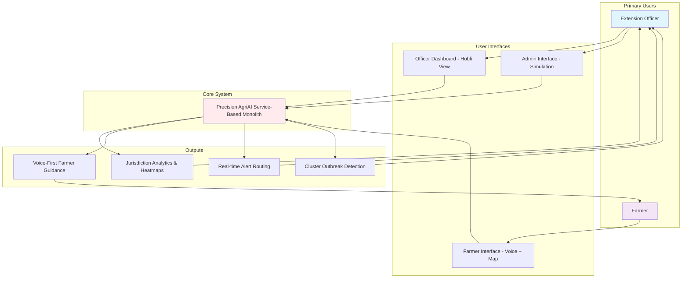
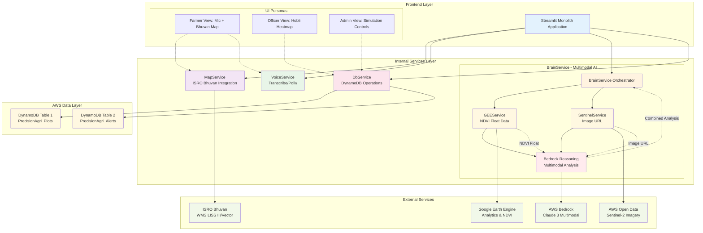
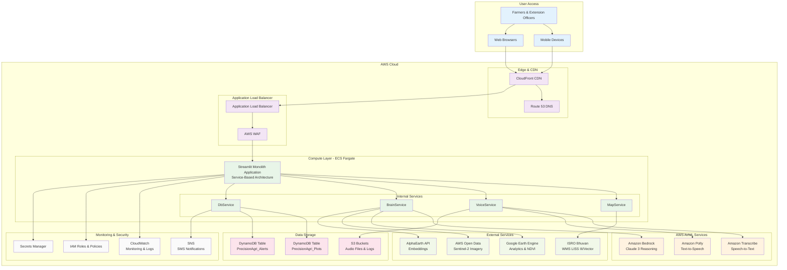
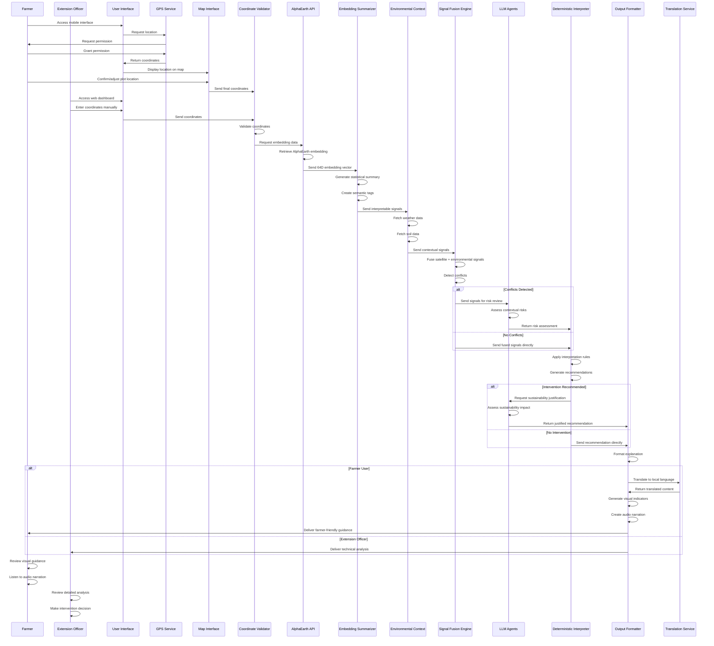
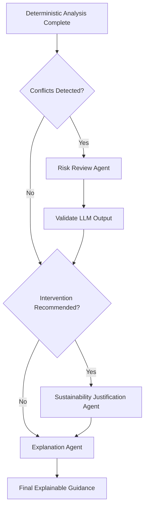

# Design Document: Precision AgriAI

## Overview

Precision AgriAI is a **Service-Based Monolith** that transforms satellite foundation model embeddings into actionable agricultural guidance for Indian farmers and Extension Officers. The system integrates with Indian government infrastructure through ISRO Bhuvan mapping and supports jurisdiction-based coordination via the Raitha Setu bridge system.

The architecture follows a **Service-Based Monolith** pattern on AWS, where a single Streamlit application orchestrates multiple internal services (MapService, VoiceService, BrainService, DbService) while maintaining clear separation of concerns. This approach provides the simplicity of monolithic deployment with the modularity of service-oriented design.

## User Interaction Diagram



## Service-Based Monolith Architecture



## Database Schema Design

### DynamoDB Two-Table Design

The system uses a **Two-Table Design** pattern in DynamoDB for optimal performance and cost efficiency:

#### Table 1: PrecisionAgri_Plots
**Purpose**: Store individual plot registrations and metadata
```
Partition Key (PK): user_id (String)
Sort Key (SK): plot_id (String)

Attributes:
- lat (Number): Latitude coordinate
- lon (Number): Longitude coordinate  
- crop (String): Crop type (rice, wheat, cotton, etc.)
- hobli_id (String): Administrative jurisdiction identifier
- farmer_name (String): Contact name for alerts
- phone_number (String): SMS notification contact
- registration_date (String): ISO timestamp
- last_analysis (String): ISO timestamp of last scan
- status (String): active, inactive, archived

GSI-1: hobli_id (PK), registration_date (SK)
- Enables Extension Officers to query all plots in their jurisdiction
```

#### Table 2: PrecisionAgri_Alerts
**Purpose**: Store alert history and enable jurisdiction-based querying
```
Partition Key (PK): hobli_id (String)
Sort Key (SK): timestamp (String) - ISO format for chronological ordering

Attributes:
- plot_id (String): Reference to originating plot
- user_id (String): Plot owner identifier
- risk_level (String): low, medium, high, critical
- message (String): Human-readable alert description
- gee_proof (Map): Google Earth Engine analytics data
  - ndvi_value (Number)
  - moisture_index (Number)
  - temperature_anomaly (Number)
- bedrock_reasoning (String): AI-generated explanation
- officer_response (String): Extension Officer action taken
- resolution_status (String): pending, acknowledged, resolved
- sms_sent (Boolean): SMS notification delivery status

GSI-1: risk_level (PK), timestamp (SK)
- Enables filtering high-priority alerts across all jurisdictions
```

### Data Access Patterns

1. **Farmer Plot Registration**: Write to PrecisionAgri_Plots with user_id + plot_id
2. **Officer Jurisdiction View**: Query PrecisionAgri_Plots GSI-1 by hobli_id
3. **Alert Generation**: Write to PrecisionAgri_Alerts with hobli_id + timestamp
4. **Cluster Outbreak Detection**: Query PrecisionAgri_Alerts by hobli_id within time range
5. **High-Priority Alert Dashboard**: Query PrecisionAgri_Alerts GSI-1 by risk_level="high"

## UI Layout Specifications

### Three Sidebar Personas

The Streamlit application provides three distinct user interfaces accessible via sidebar navigation:

#### 1. Farmer View
**Target User**: Rural farmers interacting via voice and visual map selection

**Layout Components**:
- **Big Mic Button**: Prominent voice input control (streamlit-audio-recorder)
  - Large, touch-friendly design for mobile devices
  - Visual feedback during recording (pulsing animation)
  - Language selection dropdown (Hindi, Tamil, Telugu, English)
- **ISRO Bhuvan Map**: Interactive map interface (streamlit-folium + Bhuvan WMS)
  - LISS III satellite imagery as base layer
  - Click/tap coordinate capture
  - Draggable plot markers for precision adjustment
  - GPS auto-location button
- **Audio Response Card**: Voice output and visual feedback
  - Audio playback controls (AWS Polly generated)
  - Visual stress indicators (color-coded: green/yellow/orange/red)
  - Simple action recommendations with icons
  - Confidence level display

**Mobile Optimization**:
- Single-column layout for mobile screens
- Large touch targets (minimum 44px)
- Swipe gestures for map navigation
- Voice-first interaction paradigm

#### 2. Officer View (Extension Officer Dashboard)
**Target User**: Extension Officers monitoring their jurisdiction (Hobli)

**Layout Components**:
- **Hobli Heatmap**: Geographic visualization of jurisdiction stress levels
  - ISRO Bhuvan base map with jurisdiction boundaries
  - Color-coded plot markers based on risk levels
  - Cluster outbreak detection overlays
  - Time-based filtering controls (last 24h, 7d, 30d)
- **Aggregated Statistics Panel**:
  - Total plots under monitoring
  - Active alerts by risk level (high/medium/low)
  - Sustainability metrics dashboard
  - Intervention success rates
- **Alert Management Table**:
  - Real-time alert feed for the jurisdiction
  - Sortable by timestamp, risk level, plot location
  - Quick action buttons (acknowledge, resolve, escalate)
  - SMS notification status tracking
- **Jurisdiction Analytics**:
  - Trend analysis charts (NDVI, moisture, temperature)
  - Seasonal comparison graphs
  - Crop health distribution pie charts
  - Government reporting export functionality

**Responsive Design**:
- Two-column layout on desktop (map + stats)
- Collapsible sidebar for mobile
- Tabbed interface for different data views

#### 3. Admin View (System Administration)
**Target User**: System administrators and demo operators

**Layout Components**:
- **Simulation Controls**:
  - **Add Plot Button**: Manual plot registration form
    - Coordinate input (lat/lon or map click)
    - Farmer details form (name, phone, crop type)
    - Hobli assignment dropdown
    - Bulk import CSV functionality
  - **Trigger Sentry Button**: Manual alert generation
    - Select target plots or entire jurisdiction
    - Simulate different risk levels
    - Generate synthetic GEE data for testing
    - Batch SMS notification testing
- **System Monitoring Dashboard**:
  - Service health indicators (MapService, VoiceService, BrainService, DbService)
  - API response time metrics
  - DynamoDB read/write capacity utilization
  - Error rate monitoring and alerting
- **Data Management Tools**:
  - Plot data export/import functionality
  - Alert history cleanup utilities
  - User role management interface
  - System configuration panel

**Developer Features**:
- Debug mode toggle for detailed logging
- API endpoint testing interface
- Database query builder
- Performance profiling tools

### Responsive Design Principles

1. **Mobile-First Approach**: All layouts optimized for mobile devices first
2. **Progressive Enhancement**: Desktop features added without breaking mobile experience
3. **Touch-Friendly Interactions**: Minimum 44px touch targets, swipe gestures
4. **Accessibility Compliance**: Screen reader support, keyboard navigation, high contrast mode
5. **Offline Capability**: Critical functions work with intermittent connectivity

## Service Architecture Details

### MapService (ISRO Bhuvan Integration)
**Purpose**: Handle all mapping and geospatial operations

**Responsibilities**:
- ISRO Bhuvan WMS integration (LISS III/Vector layers)
- Coordinate validation and normalization
- Plot marker management and visualization
- Jurisdiction boundary rendering
- GPS location services integration

**Key Methods**:
```python
class MapService:
    def get_bhuvan_tile_url(self, zoom: int, x: int, y: int) -> str
    def validate_coordinates(self, lat: float, lon: float) -> bool
    def get_hobli_from_coordinates(self, lat: float, lon: float) -> str
    def render_jurisdiction_heatmap(self, hobli_id: str) -> folium.Map
```

### VoiceService (AWS Transcribe/Polly)
**Purpose**: Handle all voice input/output operations

**Responsibilities**:
- Audio transcription via AWS Transcribe
- Intent detection and entity extraction
- Multi-language audio generation via AWS Polly
- Voice command processing and routing

**Key Methods**:
```python
class VoiceService:
    async def transcribe_audio(self, audio_data: bytes, language: str) -> str
    async def generate_speech(self, text: str, language: str) -> bytes
    def detect_intent(self, transcribed_text: str) -> Intent
    def extract_coordinates_from_speech(self, text: str) -> Tuple[float, float]
```

### BrainService (AWS Bedrock Reasoning)
**Purpose**: Orchestrate multimodal AI analysis by combining satellite data and imagery for Bedrock reasoning

**Refined Architecture**:
```
BrainService → GEEService (NDVI Float) + SentinelService (Image URL) → Bedrock Multimodal Analysis
```

**Responsibilities**:
- Coordinate data collection from GEEService and SentinelService
- Combine numerical satellite data (NDVI) with visual satellite imagery
- Send multimodal inputs to AWS Bedrock for contextual reasoning
- Risk assessment and urgency classification based on combined analysis
- Generate sustainability-focused recommendations

**Key Methods**:
```python
class BrainService:
    def __init__(self):
        self.gee_service = GEEService()
        self.sentinel_service = SentinelService()
        self.bedrock_client = boto3.client('bedrock-runtime')
    
    async def analyze_plot(self, lat: float, lon: float) -> AnalysisResult:
        """
        Multimodal analysis combining GEE data and Sentinel imagery
        """
        # Step 1: Get NDVI data from Google Earth Engine
        gee_data = await self.gee_service.get_ndvi_analysis(lat, lon)
        ndvi_value = gee_data.ndvi_float  # Primary numerical indicator
        
        # Step 2: Get Sentinel-2 imagery URL from AWS Open Data
        sentinel_data = await self.sentinel_service.get_latest_image(lat, lon)
        image_url = sentinel_data.image_url  # Visual evidence
        
        # Step 3: Send BOTH to Bedrock for multimodal reasoning
        bedrock_response = await self._bedrock_multimodal_analysis(
            ndvi_value=ndvi_value,
            image_url=image_url,
            coordinates=(lat, lon),
            additional_context=gee_data.metadata
        )
        
        return AnalysisResult(
            gee_data=gee_data,
            sentinel_data=sentinel_data,
            bedrock_reasoning=bedrock_response,
            risk_level=bedrock_response.risk_classification,
            confidence=bedrock_response.confidence_score
        )
    
    async def _bedrock_multimodal_analysis(
        self, 
        ndvi_value: float, 
        image_url: str, 
        coordinates: Tuple[float, float],
        additional_context: dict
    ) -> BedrockResponse:
        """
        Send both numerical data and imagery to Bedrock for analysis
        """
        prompt = f"""
        Analyze this agricultural plot for stress indicators:
        
        NUMERICAL DATA:
        - NDVI Value: {ndvi_value}
        - Coordinates: {coordinates}
        - Additional GEE Metrics: {additional_context}
        
        VISUAL DATA:
        - Sentinel-2 Image: {image_url}
        
        Provide:
        1. Risk assessment (low/medium/high/critical)
        2. Confidence score (0-1)
        3. Reasoning combining both numerical and visual evidence
        4. Sustainability-focused recommendations
        """
        
        # Bedrock multimodal call with both text and image
        response = await self.bedrock_client.invoke_model(
            modelId='anthropic.claude-3-sonnet-20240229-v1:0',
            body=json.dumps({
                "anthropic_version": "bedrock-2023-05-31",
                "max_tokens": 1000,
                "messages": [
                    {
                        "role": "user",
                        "content": [
                            {"type": "text", "text": prompt},
                            {"type": "image", "source": {"type": "url", "url": image_url}}
                        ]
                    }
                ]
            })
        )
        
        return BedrockResponse.parse(response)
    
    async def classify_urgency(self, analysis_result: AnalysisResult) -> str:
        """
        Classify urgency based on combined GEE + Sentinel + Bedrock analysis
        """
        # Use Bedrock's multimodal reasoning for final classification
        return analysis_result.bedrock_reasoning.risk_classification
    
    async def generate_farmer_guidance(
        self, 
        analysis: AnalysisResult, 
        language: str
    ) -> str:
        """
        Generate farmer-friendly guidance based on multimodal analysis
        """
        guidance_prompt = f"""
        Convert this technical analysis into farmer-friendly guidance in {language}:
        
        Technical Analysis: {analysis.bedrock_reasoning.explanation}
        NDVI Value: {analysis.gee_data.ndvi_float}
        Visual Evidence: {analysis.bedrock_reasoning.visual_observations}
        
        Provide simple, actionable advice for the farmer.
        """
        
        response = await self.bedrock_client.invoke_model(
            modelId='anthropic.claude-3-haiku-20240307-v1:0',
            body=json.dumps({
                "anthropic_version": "bedrock-2023-05-31",
                "max_tokens": 500,
                "messages": [{"role": "user", "content": guidance_prompt}]
            })
        )
        
        return response['content'][0]['text']
    
    def detect_cluster_outbreak(self, hobli_alerts: List[Alert]) -> ClusterAnalysis:
        """
        Analyze multiple alerts for coordinated outbreak patterns
        """
        # Aggregate NDVI values and visual patterns across alerts
        ndvi_values = [alert.gee_proof.ndvi_value for alert in hobli_alerts]
        avg_ndvi = sum(ndvi_values) / len(ndvi_values)
        
        # Determine if this represents a coordinated outbreak
        outbreak_detected = len(hobli_alerts) >= 3 and avg_ndvi < 0.3
        
        return ClusterAnalysis(
            outbreak_detected=outbreak_detected,
            affected_plots=len(hobli_alerts),
            avg_ndvi=avg_ndvi,
            severity="high" if outbreak_detected else "medium",
            recommended_action="coordinate_intervention" if outbreak_detected else "monitor"
        )
```

**Supporting Services**:

```python
class GEEService:
    """Google Earth Engine integration for numerical satellite analytics"""
    
    async def get_ndvi_analysis(self, lat: float, lon: float) -> GEEData:
        """
        Fetch NDVI and other vegetation indices from Google Earth Engine
        """
        point = ee.Geometry.Point([lon, lat])
        
        # Get latest Landsat/Sentinel data
        collection = ee.ImageCollection('LANDSAT/LC08/C02/T1_L2') \
            .filterBounds(point) \
            .filterDate('2024-01-01', '2024-12-31') \
            .sort('system:time_start', False) \
            .first()
        
        # Calculate NDVI
        ndvi = collection.normalizedDifference(['SR_B5', 'SR_B4']).rename('NDVI')
        ndvi_value = ndvi.sample(point, 30).first().get('NDVI').getInfo()
        
        return GEEData(
            ndvi_float=float(ndvi_value),
            acquisition_date=collection.get('system:time_start').getInfo(),
            cloud_cover=collection.get('CLOUD_COVER').getInfo(),
            metadata={
                'sensor': 'Landsat-8',
                'resolution': '30m',
                'bands_used': ['SR_B5', 'SR_B4']
            }
        )

class SentinelService:
    """AWS Open Data Sentinel-2 integration for visual satellite imagery"""
    
    async def get_latest_image(self, lat: float, lon: float) -> SentinelData:
        """
        Fetch latest cloud-free Sentinel-2 RGB image from AWS Open Data
        """
        # Find appropriate Sentinel-2 tile for coordinates
        tile_id = self._get_sentinel_tile(lat, lon)
        
        # Search for latest cloud-free image
        s3_client = boto3.client('s3')
        bucket = 'sentinel-s2-l2a'
        
        # Construct S3 path for RGB composite
        date_prefix = datetime.now().strftime('%Y/%m')
        s3_key = f"tiles/{tile_id[:2]}/{tile_id[2]}/{tile_id[3:]}/{date_prefix}/0/R60m/TCI.jp2"
        
        # Generate presigned URL for Bedrock access
        image_url = s3_client.generate_presigned_url(
            'get_object',
            Params={'Bucket': bucket, 'Key': s3_key},
            ExpiresIn=3600
        )
        
        return SentinelData(
            image_url=image_url,
            tile_id=tile_id,
            acquisition_date=self._extract_date_from_key(s3_key),
            cloud_cover_percentage=self._get_cloud_cover(s3_key),
            resolution='60m'
        )
```

### DbService (DynamoDB Operations)
**Purpose**: Handle all database operations and data persistence

**Responsibilities**:
- Plot registration and management
- Alert creation and tracking
- Jurisdiction-based data querying
- Officer dashboard data aggregation

**Key Methods**:
```python
class DbService:
    def register_plot(self, user_id: str, plot_data: PlotData) -> str
    def create_alert(self, hobli_id: str, alert_data: AlertData) -> None
    def get_hobli_plots(self, hobli_id: str) -> List[Plot]
    def get_recent_alerts(self, hobli_id: str, hours: int = 24) -> List[Alert]
```
        end
        
        subgraph "Agentic AI Layer"
            RRA[Risk Review Agent]
            SJA[Sustainability Justification Agent]
            EA[Explanation Agent]
            LLM[LLM Services]
        end
        
        subgraph "Output Processing"
            EF[Explanation Formatter]
            FFF[Farmer-Friendly Formatter]
            TS[Translation Service]
            AS[Audio Service]
        end
    end
    
    subgraph "External Services"
        ALPHA[AlphaEarth API]
        WEATHER[Weather API]
        SOIL[Soil Data API]
        TRANS[Translation API]
        MAPS[Map Services]
    end
    
    subgraph "Data Layer"
        CACHE[Redis Cache]
        LOGS[Logging System]
        METRICS[Metrics Store]
    end
    
    subgraph "Infrastructure"
        MONITOR[Monitoring]
        SECURITY[Security Layer]
        CONFIG[Configuration]
    end
    
    %% User to API Gateway
    U1 --> AG
    U2 --> AG
    U3 --> AG
    U4 --> AG
    
    %% API Gateway to Load Balancer
    AG --> LB
    
    %% Load Balancer to Application
    LB --> CV
    LB --> GPS
    LB --> MAP
    
    %% Input Processing Flow
    CV --> AE
    GPS --> CV
    MAP --> CV
    
    %% Core Processing Pipeline
    AE --> ES
    ES --> ECI
    ECI --> SFE
    SFE --> DI
    
    %% Conditional Agentic AI
    SFE -.->|Conflicts Detected| RRA
    DI -.->|Intervention Recommended| SJA
    RRA --> EA
    SJA --> EA
    EA --> EF
    
    %% Direct to Output (No AI needed)
    DI --> EF
    
    %% Output Processing
    EF --> FFF
    FFF --> TS
    FFF --> AS
    
    %% External Service Connections
    AE --> ALPHA
    ECI --> WEATHER
    ECI --> SOIL
    RRA --> LLM
    SJA --> LLM
    EA --> LLM
    TS --> TRANS
    MAP --> MAPS
    GPS --> MAPS
    
    %% Data Layer Connections
    ECI --> CACHE
    AE --> CACHE
    EF --> LOGS
    DI --> METRICS
    
    %% Infrastructure Connections
    AG --> SECURITY
    LB --> MONITOR
    CONFIG --> AE
    CONFIG --> LLM
    
    %% Styling
    classDef userLayer fill:#e3f2fd
    classDef apiLayer fill:#f3e5f5
    classDef appLayer fill:#e8f5e8
    classDef agentLayer fill:#fff3e0
    classDef outputLayer fill:#fce4ec
    classDef externalLayer fill:#f1f8e9
    classDef dataLayer fill:#fff8e1
    classDef infraLayer fill:#fafafa
    
    class U1,U2,U3,U4 userLayer
    class AG,LB apiLayer
    class CV,GPS,MAP,AE,ES,ECI,SFE,DI appLayer
    class RRA,SJA,EA,LLM agentLayer
    class EF,FFF,TS,AS outputLayer
    class ALPHA,WEATHER,SOIL,TRANS,MAPS externalLayer
    class CACHE,LOGS,METRICS dataLayer
    class MONITOR,SECURITY,CONFIG infraLayer
```

## AWS Deployment Architecture (Service-Based Monolith)



### Deployment Benefits

**Service-Based Monolith Advantages:**
- **Single Deployment Unit**: One ECS Fargate service to deploy and manage
- **Internal Service Isolation**: Clear separation of concerns within the monolith
- **Simplified Networking**: No inter-service network calls or service discovery
- **Easier Development**: All code in one repository with shared dependencies
- **Cost Effective**: Single compute instance instead of multiple microservices

**AWS Integration Points:**
- **ECS Fargate**: Serverless container hosting for the Streamlit application
- **DynamoDB**: Managed NoSQL database with auto-scaling and backup
- **CloudFront**: Global CDN for fast content delivery to rural areas
- **IAM**: Fine-grained permissions for service access control
- **CloudWatch**: Comprehensive monitoring and alerting
    USERS --> WEB
    MOBILE --> CF
    WEB --> CF
    
    %% Edge Layer
    CF --> R53
    CF --> ALB
    
    %% Load Balancer
    ALB --> WAF
    WAF --> API1
    WAF --> API2
    WAF --> API3
    
    %% Compute to AI Services
    API1 --> BEDROCK
    API2 --> BEDROCK
    API3 --> BEDROCK
    L2 --> TRANSLATE
    L3 --> POLLY
    L4 --> TRANSCRIBE
    L4 --> BEDROCK
    L1 --> LOCATION
    L5 --> S3_SENTINEL
    L5 --> GEE
    
    %% Lambda Triggers
    API1 --> L1
    API2 --> L2
    API3 --> L3
    API1 --> L4
    API2 --> L5
    
    %% Data Storage
    API1 --> REDIS
    API2 --> REDIS
    API3 --> REDIS
    API1 --> S3
    API2 --> PARAM
    API3 --> SECRETS
    
    %% External APIs
    API1 --> ALPHA
    API2 --> WEATHER
    L1 --> MAPS
    
    %% Monitoring
    API1 --> CW
    API2 --> CW
    API3 --> CW
    L1 --> CW
    L2 --> CW
    L3 --> CW
    L4 --> CW
    L5 --> CW
    
    %% Security
    API1 --> IAM
    API2 --> IAM
    API3 --> IAM
    L1 --> IAM
    L2 --> IAM
    L3 --> IAM
    L4 --> IAM
    L5 --> IAM
    
    %% VPC
    API1 -.-> VPC
    API2 -.-> VPC
    API3 -.-> VPC
    REDIS -.-> VPC
    
    %% Styling
    classDef userLayer fill:#e3f2fd
    classDef edgeLayer fill:#f3e5f5
    classDef computeLayer fill:#e8f5e8
    classDef aiLayer fill:#fff3e0
    classDef dataLayer fill:#fce4ec
    classDef externalLayer fill:#f1f8e9
    classDef securityLayer fill:#fafafa
    
    class USERS,MOBILE,WEB userLayer
    class CF,R53,ALB,WAF edgeLayer
    class API1,API2,API3,L1,L2,L3,L4,L5 computeLayer
    class BEDROCK,TRANSLATE,POLLY,TRANSCRIBE,LOCATION aiLayer
    class REDIS,S3,PARAM dataLayer
    class ALPHA,WEATHER,MAPS,S3_SENTINEL,GEE externalLayer
    class CW,IAM,SECRETS,VPC securityLayer
```

### Key Design Principles

1. **Service-Based Monolith**: Clear separation of concerns through internal services while maintaining single deployment unit
2. **Government Integration**: Native integration with ISRO Bhuvan mapping and jurisdiction-based coordination via Raitha Setu
3. **Data Persistence**: DynamoDB-based storage enabling Extension Officer dashboards and alert management
4. **Voice-First Farmer Experience**: AWS Transcribe/Polly integration for natural language interaction in local dialects
5. **Jurisdiction-Based Coordination**: Hobli-level alert routing and cluster outbreak detection for Extension Officers
6. **Explainable AI**: AWS Bedrock reasoning with transparent decision-making and sustainability bias

## Raitha Setu - Government Bridge Integration

### Jurisdiction Management System

The **Raitha Setu** component provides seamless integration with Indian agricultural extension services through jurisdiction-based coordination:

#### Hobli-Based Organization
- **Jurisdiction Directory**: Maps every plot to its administrative Hobli
- **Extension Officer Assignment**: Each Hobli has a designated Extension Officer
- **Hierarchical Coordination**: Supports district and state-level aggregation

#### Alert Routing System
```python
class RaithaSetu:
    def route_alert(self, plot_coordinates: Tuple[float, float], risk_level: str) -> str:
        """Route high-urgency alerts to appropriate Extension Officer"""
        hobli_id = self.map_service.get_hobli_from_coordinates(*plot_coordinates)
        officer_id = self.jurisdiction_directory.get_officer(hobli_id)
        
        if risk_level == "high":
            self.notification_service.send_officer_alert(officer_id, alert_data)
            self.dashboard_service.update_officer_dashboard(officer_id)
        
        return officer_id
    
    def detect_cluster_outbreak(self, hobli_id: str) -> ClusterAnalysis:
        """Analyze multiple alerts within jurisdiction for outbreak patterns"""
        recent_alerts = self.db_service.get_recent_alerts(hobli_id, hours=24)
        
        if len(recent_alerts) >= 3:  # Threshold for cluster detection
            return ClusterAnalysis(
                outbreak_detected=True,
                affected_plots=len(recent_alerts),
                severity=self.calculate_cluster_severity(recent_alerts),
                recommended_action="coordinate_intervention"
            )
```

#### Government Reporting
- **Audit Trails**: Complete history of alerts, officer responses, and interventions
- **Performance Metrics**: Success rates, response times, farmer satisfaction
- **Policy Insights**: Aggregated data for agricultural policy decisions
- **Compliance Reporting**: Automated reports for government oversight

### Integration Benefits

1. **Localized Context**: ISRO Bhuvan provides familiar geographic references for Indian users
2. **Government Alignment**: Direct integration with existing agricultural extension infrastructure
3. **Scalable Coordination**: Supports coordination across multiple jurisdictions and administrative levels
4. **Data Sovereignty**: All data processing and storage within Indian/AWS infrastructure
5. **Cultural Adaptation**: Voice interfaces in local languages with agricultural terminology
    
    D --> G[Voice Processing Pipeline]
    E --> H[Coordinate Validator]
    F --> H
    G --> I[Intent Detection & Coordinate Extraction]
    I --> H
    
    H --> J[Concurrent Data Fetcher]
    J --> K[AlphaEarth API Client]
    J --> L[Visual Verification Service]
    J --> M[Environmental Context Integrator]
    
    K --> N[Embedding Summarizer]
    L --> O[AWS Sentinel-2 Data]
    L --> P[Google Earth Engine]
    M --> Q[Weather & Soil APIs]
    
    N --> R[Signal Fusion Engine]
    O --> R
    P --> R
    Q --> R
    
    R --> S{Conflicting Signals?}
    S -->|No| T[Deterministic Interpreter]
    S -->|Yes| U[LLM Risk Reviewer]
    U --> T
    
    T --> V[Cross-Reference with Visual Data]
    V --> W[Sustainability Guidance Generator]
    W --> X[Explanation Formatter]
    X --> Y{User Type?}
    Y -->|Extension Officer| Z[Technical Display]
    Y -->|Farmer| AA[Farmer-Friendly Display + Audio]
    
    Z --> BB[Streamlit Results Display]
    AA --> CC[Audio Generation + Visual Display]
    CC --> BB
```

### Monolithic Architecture Benefits

**Simplified Deployment:**
- Single `streamlit run app.py` command
- No separate backend/frontend coordination
- All components in one codebase

**Integrated State Management:**
- Streamlit session state for user interactions
- No API calls between frontend/backend
- Direct function calls within the application

**Rapid Development:**
- Immediate UI updates with code changes
- Built-in development server
- No build process required

## Data Flow Diagram



## Component Interaction Flow

1. **Input Layer**: Dual interface - web form for extension officers, GPS/map interface for farmers
2. **Location Services**: GPS integration and interactive map for farmer-direct usage
3. **Data Retrieval**: AlphaEarth API client fetches 64-dimensional embeddings
4. **Deterministic Processing**: Embedding summarizer converts vectors to interpretable signals
5. **Context Integration**: Environmental data enhances satellite-derived signals
6. **Signal Fusion**: Combines multiple data sources with conflict detection
7. **Optional Review**: LLM agents invoked only when conflicts or uncertainty exist
8. **Interpretation**: Deterministic rules generate recommendations with reasoning
9. **Output**: Dual formatting - technical for extension officers, simplified for farmers
10. **Language Processing**: Translation services for local language support

## Components and Interfaces

### Core Processing Components

#### Coordinate Validator
**Purpose**: Validates input coordinates and geographic coverage
**Interface**:
```python
from typing import Optional, Tuple
from pydantic import BaseModel

class ValidationResult(BaseModel):
    is_valid: bool
    error: Optional[str] = None
    normalized_coordinates: Optional[Tuple[float, float]] = None

class CoordinateValidator:
    def validate(self, lat: float, lon: float) -> ValidationResult:
        """Validate coordinates and return normalized result"""
        pass
    
    def is_in_supported_region(self, lat: float, lon: float) -> bool:
        """Check if coordinates are within supported geographic regions"""
        pass
```

#### AlphaEarth API Client
**Purpose**: Retrieves satellite foundation model embeddings
**Interface**:
```python
from datetime import datetime
from typing import List, Dict, Any
import httpx

class EmbeddingMetadata(BaseModel):
    resolution: str
    data_source: str

class EmbeddingResult(BaseModel):
    embedding: List[float]  # 64-dimensional vector
    timestamp: datetime
    confidence: float
    metadata: EmbeddingMetadata

class AlphaEarthClient:
    def __init__(self, api_key: str, base_url: str):
        self.client = httpx.AsyncClient()
        self.api_key = api_key
        self.base_url = base_url
    
    async def get_embedding(self, lat: float, lon: float) -> EmbeddingResult:
        """Retrieve AlphaEarth embedding for coordinates"""
        pass
    
    def verify_embedding_integrity(self, embedding: List[float]) -> bool:
        """Verify embedding is 64-dimensional and valid"""
        return len(embedding) == 64 and all(isinstance(x, (int, float)) for x in embedding)
```

#### Embedding Summarizer
**Purpose**: Converts 64D embeddings to interpretable statistical measures
**Interface**:
```python
import numpy as np
from typing import List

class QualityFlags(BaseModel):
    has_anomalies: bool
    confidence_level: str  # 'high', 'medium', 'low'
    data_quality_issues: List[str]

class StatisticalMeasures(BaseModel):
    mean: float
    variance: float
    skewness: float
    kurtosis: float
    dominant_components: List[float]

class SummaryResult(BaseModel):
    statistical_measures: StatisticalMeasures
    quality_flags: QualityFlags

class EmbeddingSummarizer:
    def summarize(self, embedding: List[float]) -> SummaryResult:
        """Convert 64D embedding to statistical measures"""
        arr = np.array(embedding)
        return SummaryResult(
            statistical_measures=StatisticalMeasures(
                mean=float(np.mean(arr)),
                variance=float(np.var(arr)),
                skewness=float(self._calculate_skewness(arr)),
                kurtosis=float(self._calculate_kurtosis(arr)),
                dominant_components=self._get_dominant_components(arr)
            ),
            quality_flags=self._assess_quality(arr)
        )
    
    def generate_semantic_tags(self, summary: SummaryResult) -> List[str]:
        """Generate human-readable tags from statistical summary"""
        pass
```

#### Environmental Context Integrator
**Purpose**: Retrieves and integrates weather and soil data
**Interface**:
```python
class WeatherContext(BaseModel):
    temperature: Dict[str, Any]  # current, trend
    precipitation: Dict[str, float]  # recent, seasonal
    humidity: float
    wind_speed: float

class SoilContext(BaseModel):
    type: str
    moisture: str  # 'dry', 'optimal', 'saturated'
    ph: float
    organic_matter: float

class StressSignal(BaseModel):
    type: str  # 'vegetation_stress', 'water_stress', etc.
    intensity: float  # 0-1 scale
    confidence: float  # 0-1 scale
    source: str  # 'satellite', 'weather', 'soil'
    reasoning: str

class ConflictFlag(BaseModel):
    conflict_type: str
    description: str
    affected_signals: List[str]
    severity: str  # 'low', 'medium', 'high'

class ContextualSignals(BaseModel):
    satellite_signals: List[StressSignal]
    environmental_signals: List[StressSignal]
    conflicts: List[ConflictFlag]

class EnvironmentalContextIntegrator:
    async def get_weather_context(self, lat: float, lon: float) -> WeatherContext:
        """Fetch weather data for location"""
        pass
    
    async def get_soil_context(self, lat: float, lon: float) -> SoilContext:
        """Fetch soil data for location"""
        pass
    
    def integrate_context(
        self, 
        summary: SummaryResult, 
        weather: WeatherContext, 
        soil: SoilContext
    ) -> ContextualSignals:
        """Combine satellite and environmental data"""
        pass
```

### Agentic AI Components

#### LLM Risk Reviewer
**Purpose**: Reviews signals for contextual risks when conflicts exist
**Interface**:
```python
import boto3
from typing import Optional

class ConfidenceAdjustments(BaseModel):
    original_confidence: float
    adjusted_confidence: float
    reasoning: str

class RiskReview(BaseModel):
    risk_assessment: str
    confidence_adjustments: ConfidenceAdjustments
    additional_contextual_risks: List[str]
    recommendation_modifier: str  # 'none', 'increase_caution', 'increase_urgency'

class LLMRiskReviewer:
    def __init__(self):
        self.bedrock = boto3.client('bedrock-runtime')
    
    async def review_signals(self, signals: ContextualSignals) -> RiskReview:
        """Review signals for contextual risks using AWS Bedrock"""
        pass
    
    def should_invoke(self, signals: ContextualSignals) -> bool:
        """Determine if LLM review is needed based on conflicts"""
        return len(signals.conflicts) > 0 or any(
            signal.confidence < 0.7 for signal in signals.satellite_signals
        )
```

#### Sustainability Justification Agent
**Purpose**: Ensures recommendations align with sustainability goals
**Interface**:
```python
class SustainabilityJustification(BaseModel):
    sustainability_score: int  # 0-100
    intervention_cost: str  # 'low', 'medium', 'high'
    environmental_impact: str
    alternative_approaches: List[str]
    justification: str

class InterventionRecommendation(BaseModel):
    action: str  # 'act', 'monitor', 'no_action'
    urgency: str  # 'immediate', 'within_week', 'within_month', 'routine'
    intervention_type: Optional[str] = None
    reasoning: str
    alternatives: List[str]

class SustainabilityJustificationAgent:
    def __init__(self):
        self.bedrock = boto3.client('bedrock-runtime')
    
    async def justify_recommendation(
        self,
        recommendation: InterventionRecommendation,
        signals: ContextualSignals
    ) -> SustainabilityJustification:
        """Ensure recommendations align with sustainability principles"""
        pass
```

#### Explanation Agent
**Purpose**: Translates technical reasoning into human-readable guidance
**Interface**:
```python
class ExplainableGuidance(BaseModel):
    summary: str
    reasoning: List[str]
    key_assumptions: List[str]
    uncertainty_level: str  # 'low', 'medium', 'high'
    recommended_action: str  # 'act', 'monitor', 'no_action'
    action_justification: str

class FarmerGuidance(BaseModel):
    summary: str  # Simple, non-technical language
    stress_level: str  # 'good', 'watch', 'action_needed', 'urgent'
    visual_indicators: Dict[str, Any]
    action_steps: List[Dict[str, Any]]
    audio_narration: Optional[str] = None
    confidence: str  # 'high', 'medium', 'low'

class ExplanationAgent:
    def __init__(self):
        self.bedrock = boto3.client('bedrock-runtime')
        self.translate = boto3.client('translate')
        self.polly = boto3.client('polly')
    
    async def generate_explanation(
        self,
        interpretation: 'DeterministicInterpretation',
        risk_review: Optional[RiskReview] = None,
        sustainability_justification: Optional[SustainabilityJustification] = None
    ) -> ExplainableGuidance:
        """Generate technical explanation for extension officers"""
        pass
    
    async def generate_farmer_explanation(
        self,
        interpretation: 'DeterministicInterpretation',
        language: str = 'en'
    ) -> FarmerGuidance:
        """Generate farmer-friendly explanation with translation"""
        pass
```

### Farmer-Direct Interface Components

#### GPS Location Service
**Purpose**: Automatic location detection for farmers visiting plots
**Interface**:
```typescript
interface GPSLocationService {
  requestLocationPermission(): Promise<PermissionResult>
  getCurrentLocation(): Promise<LocationResult>
  validateLocationAccuracy(location: LocationResult): boolean
  saveFrequentLocation(location: LocationResult, name: string): void
}

type LocationResult = {
  latitude: number
  longitude: number
  accuracy: number // meters
  timestamp: Date
  source: 'gps' | 'network' | 'manual'
}

type PermissionResult = {
  granted: boolean
  error?: string
  fallbackOptions: string[]
}
```

#### Interactive Map Interface
**Purpose**: Visual plot selection and confirmation for farmers
**Interface**:
```typescript
interface InteractiveMapInterface {
  displayMap(centerLat: number, centerLon: number, zoom: number): void
  onMapClick(callback: (lat: number, lon: number) => void): void
  addPlotMarker(lat: number, lon: number): PlotMarker
  showSatelliteImagery(lat: number, lon: number): void
  enableMarkerDragging(marker: PlotMarker): void
}

type PlotMarker = {
  id: string
  coordinates: {lat: number, lon: number}
  draggable: boolean
  confirmed: boolean
  onDragEnd: (newLat: number, newLon: number) => void
}
```

#### Language Translation Service
**Purpose**: Local language support for farmer accessibility
**Interface**:
```typescript
interface LanguageTranslationService {
  getSupportedLanguages(): LanguageOption[]
  translateInterface(language: string): Promise<TranslationResult>
  translateRecommendation(text: string, language: string): Promise<string>
  setUserLanguage(language: string): void
  getFallbackLanguage(): string
}

type LanguageOption = {
  code: string // 'hi', 'ta', 'te', 'en'
  name: string
  nativeName: string
  supported: boolean
}

type TranslationResult = {
  success: boolean
  translations: Record<string, string>
  fallbackUsed: boolean
  error?: string
}
```

#### Farmer-Friendly Output Formatter
**Purpose**: Simplified, visual output for farmers
**Interface**:
```typescript
interface FarmerFriendlyFormatter {
  formatForFarmer(
    interpretation: DeterministicInterpretation,
    language: string
  ): FarmerGuidance
  generateVisualIndicators(stressLevel: string): VisualIndicators
  createAudioNarration(guidance: FarmerGuidance): AudioContent
  generateActionSteps(recommendation: InterventionRecommendation): ActionStep[]
}

type FarmerGuidance = {
  summary: string // Simple, non-technical language
  stressLevel: 'good' | 'watch' | 'action_needed' | 'urgent'
  visualIndicators: VisualIndicators
  actionSteps: ActionStep[]
  audioNarration?: AudioContent
  confidence: 'high' | 'medium' | 'low'
}

type VisualIndicators = {
  color: 'green' | 'yellow' | 'orange' | 'red'
  icon: string
  progressBar?: number // 0-100
  mapOverlay?: string
}

type ActionStep = {
  step: number
  description: string
  icon: string
  urgency: 'immediate' | 'this_week' | 'this_month' | 'monitor'
  estimatedCost?: 'low' | 'medium' | 'high'
}

#### Voice Bridge Service
**Purpose**: Conversational interface for voice-based farmer interactions
**Interface**:
```python
import boto3
from typing import Dict, Any

class VoiceLanguageOption(BaseModel):
    code: str  # 'hi-IN', 'ta-IN', 'te-IN', 'en-IN'
    name: str
    native_name: str
    voice_id: str  # AWS Polly voice ID
    transcribe_supported: bool

class IntentResult(BaseModel):
    intent: str  # 'check_crop', 'register_plot', 'get_help', 'unknown'
    entities: Dict[str, Any]
    confidence: float

class VoiceProcessingResult(BaseModel):
    transcribed_text: str
    detected_language: str
    confidence: float
    intent: IntentResult
    processing_time_ms: int

class AudioResponse(BaseModel):
    audio_url: str
    duration: int
    text: str
    language: str
    generated_at: datetime

class VoiceBridgeService:
    def __init__(self):
        self.transcribe = boto3.client('transcribe')
        self.bedrock = boto3.client('bedrock-runtime')
        self.polly = boto3.client('polly')
        self.s3 = boto3.client('s3')
    
    async def process_audio_input(
        self, 
        audio_data: bytes, 
        language: Optional[str] = None
    ) -> VoiceProcessingResult:
        """Process audio input through transcription and intent detection"""
        pass
    
    async def detect_intent(self, transcribed_text: str) -> IntentResult:
        """Detect user intent using AWS Bedrock"""
        pass
    
    async def generate_audio_response(
        self, 
        text: str, 
        language: str
    ) -> AudioResponse:
        """Generate spoken response using AWS Polly"""
        pass
    
    def get_supported_voice_languages(self) -> List[VoiceLanguageOption]:
        """Return supported voice languages"""
        return [
            VoiceLanguageOption(
                code='hi-IN',
                name='Hindi (India)',
                native_name='हिन्दी',
                voice_id='Aditi',
                transcribe_supported=True
            ),
            # Add more languages...
        ]
```

#### Visual Verification Service
**Purpose**: Fetch and validate satellite imagery for trust layer
**Interface**:
```python
import rasterio
from datetime import datetime, timedelta

class SatelliteImage(BaseModel):
    image_url: str
    metadata: Dict[str, Any]
    coordinates: Dict[str, float]
    quality_flags: Dict[str, bool]

class VerificationResult(BaseModel):
    is_consistent: bool
    confidence_warning: Optional[Dict[str, Any]] = None
    visual_evidence: Dict[str, Any]
    cross_reference_score: float  # 0-1 scale

class CloudCoverResult(BaseModel):
    cloud_cover_percentage: float
    cloud_free_areas: Dict[str, bool]
    quality_assessment: str  # 'usable', 'marginal', 'unusable'

class VisualVerificationService:
    def __init__(self):
        self.s3 = boto3.client('s3')
        # AWS Open Data bucket for Sentinel-2
        self.sentinel_bucket = 'sentinel-s2-l2a'
    
    async def fetch_sentinel2_image(
        self, 
        lat: float, 
        lon: float, 
        date: Optional[datetime] = None
    ) -> SatelliteImage:
        """Fetch latest cloud-free Sentinel-2 image from AWS Open Data"""
        if date is None:
            date = datetime.now() - timedelta(days=30)  # Look back 30 days
        
        # Implementation would search for appropriate Sentinel-2 tiles
        pass
    
    async def cross_reference_with_gee(
        self,
        sentinel_image: SatelliteImage,
        gee_vegetation_index: float
    ) -> VerificationResult:
        """Cross-reference Sentinel-2 with Google Earth Engine data"""
        pass
    
    async def detect_cloud_cover(self, image: SatelliteImage) -> CloudCoverResult:
        """Analyze cloud cover in satellite image"""
        pass
```

#### Proactive Sentry Service
**Purpose**: Background monitoring system for registered plots with SMS notifications
**Interface**:
```python
import boto3
from typing import List, Dict, Any
from datetime import datetime, timedelta

class PlotRegistration(BaseModel):
    plot_id: str
    farmer_name: str
    phone_number: str  # For SMS notifications
    coordinates: Tuple[float, float]
    registered_at: datetime
    last_scanned: Optional[datetime] = None

class AlertResult(BaseModel):
    plot_id: str
    urgency_level: str  # 'low', 'medium', 'high'
    risk_summary: str
    recommended_action: str
    confidence: float
    analysis_timestamp: datetime

class SMSNotification(BaseModel):
    phone_number: str
    message: str
    deep_link: str
    sent_at: datetime
    delivery_status: str

class ProactiveSentryService:
    def __init__(self):
        self.sns = boto3.client('sns')
        self.bedrock = boto3.client('bedrock-runtime')
        self.registered_plots: List[PlotRegistration] = []
    
    def register_plot(
        self, 
        farmer_name: str, 
        phone_number: str, 
        lat: float, 
        lon: float
    ) -> str:
        """Register a plot for proactive monitoring"""
        plot_id = f"plot_{len(self.registered_plots) + 1:04d}"
        
        registration = PlotRegistration(
            plot_id=plot_id,
            farmer_name=farmer_name,
            phone_number=phone_number,
            coordinates=(lat, lon),
            registered_at=datetime.now()
        )
        
        self.registered_plots.append(registration)
        return plot_id
    
    async def simulate_daily_scan(self) -> List[AlertResult]:
        """Simulate daily scan of all registered plots (demo trigger)"""
        alerts = []
        
        for plot in self.registered_plots:
            try:
                # Run full analysis pipeline (GEE Math + Bedrock Reasoning)
                lat, lon = plot.coordinates
                analysis_result = await self.analyze_plot_for_sentry(lat, lon)
                
                # Only generate alert if Bedrock classifies as "High Urgency"
                if analysis_result.urgency_level == 'high':
                    alert = AlertResult(
                        plot_id=plot.plot_id,
                        urgency_level=analysis_result.urgency_level,
                        risk_summary=analysis_result.risk_summary,
                        recommended_action=analysis_result.recommended_action,
                        confidence=analysis_result.confidence,
                        analysis_timestamp=datetime.now()
                    )
                    
                    alerts.append(alert)
                    
                    # Send SMS notification via AWS SNS
                    await self.send_sms_alert(plot, alert)
                
                # Update last scanned timestamp
                plot.last_scanned = datetime.now()
                
            except Exception as e:
                print(f"Error scanning plot {plot.plot_id}: {str(e)}")
                continue
        
        return alerts
    
    async def send_sms_alert(
        self, 
        plot: PlotRegistration, 
        alert: AlertResult
    ) -> SMSNotification:
        """Send SMS notification via AWS SNS with deep link"""
        
        # Generate deep link to Streamlit app
        deep_link = f"https://your-streamlit-app.com/?plot_id={plot.plot_id}"
        
        # Compose SMS message
        message = f"""🚨 CROP ALERT - {plot.farmer_name}
Plot: {plot.plot_id}
Issue: {alert.risk_summary}
Action: {alert.recommended_action}
View details: {deep_link}"""
        
        try:
            # Send SMS via AWS SNS
            response = self.sns.publish(
                PhoneNumber=plot.phone_number,
                Message=message,
                MessageAttributes={
                    'AWS.SNS.SMS.SMSType': {
                        'DataType': 'String',
                        'StringValue': 'Transactional'
                    }
                }
            )
            
            return SMSNotification(
                phone_number=plot.phone_number,
                message=message,
                deep_link=deep_link,
                sent_at=datetime.now(),
                delivery_status='sent'
            )
            
        except Exception as e:
            print(f"Failed to send SMS to {plot.phone_number}: {str(e)}")
            raise
```
```

### Integration Components

#### Signal Fusion Engine
**Purpose**: Combines satellite and environmental signals with conflict detection
**Interface**:
```typescript
interface SignalFusionEngine {
  fuseSignals(
    satelliteSignals: StressSignal[],
    environmentalSignals: StressSignal[]
  ): FusedSignals
  detectConflicts(signals: StressSignal[]): ConflictFlag[]
}

type StressSignal = {
  type: 'vegetation_stress' | 'water_stress' | 'soil_degradation' | 'stability'
  intensity: number // 0-1 scale
  confidence: number // 0-1 scale
  source: 'satellite' | 'weather' | 'soil'
  reasoning: string
}

type FusedSignals = {
  primarySignals: StressSignal[]
  secondarySignals: StressSignal[]
  overallStressLevel: number
  conflicts: ConflictFlag[]
  fusionConfidence: number
}

type ConflictFlag = {
  conflictType: 'signal_contradiction' | 'confidence_mismatch' | 'temporal_inconsistency'
  description: string
  affectedSignals: string[]
  severity: 'low' | 'medium' | 'high'
}
```

#### Deterministic Interpreter
**Purpose**: Generates recommendations using rule-based logic
**Interface**:
```typescript
interface DeterministicInterpreter {
  interpret(fusedSignals: FusedSignals): DeterministicInterpretation
  applyInterpretationRules(signals: StressSignal[]): InterventionRecommendation
}

type DeterministicInterpretation = {
  stressAssessment: {
    level: 'none' | 'low' | 'medium' | 'high' | 'critical'
    primaryFactors: string[]
    confidence: number
  }
  recommendation: InterventionRecommendation
  reasoning: string[]
  dataQuality: 'excellent' | 'good' | 'fair' | 'poor'
}

type InterventionRecommendation = {
  action: 'act' | 'monitor' | 'no_action'
  urgency: 'immediate' | 'within_week' | 'within_month' | 'routine'
  interventionType?: 'irrigation' | 'fertilization' | 'pest_control' | 'soil_treatment'
  reasoning: string
  alternatives: string[]
}
```

## Data Models

### Core Data Structures

#### Plot Information
```typescript
type Plot = {
  coordinates: {
    latitude: number
    longitude: number
    precision: number // decimal places
  }
  metadata: {
    region: string
    supportedByAlphaEarth: boolean
    lastAnalyzed?: Date
  }
}
```

#### Analysis Session
```typescript
type AnalysisSession = {
  sessionId: string
  plot: Plot
  timestamp: Date
  processingSteps: ProcessingStep[]
  result?: AnalysisResult
  errors: ProcessingError[]
}

type ProcessingStep = {
  component: string
  startTime: Date
  endTime?: Date
  status: 'pending' | 'processing' | 'completed' | 'failed'
  output?: any
  processingTimeMs?: number
}

type ProcessingError = {
  component: string
  errorType: string
  message: string
  timestamp: Date
  recoverable: boolean
}
```

#### Analysis Result
```typescript
type AnalysisResult = {
  plot: Plot
  embedding: {
    data: number[]
    metadata: EmbeddingMetadata
  }
  interpretation: {
    deterministic: DeterministicInterpretation
    llmEnhanced?: {
      riskReview: RiskReview
      sustainabilityJustification: SustainabilityJustification
    }
  }
  explanation: ExplainableGuidance
  processingMetrics: {
    totalTimeMs: number
    componentTimes: Record<string, number>
    llmInvoked: boolean
    dataQuality: string
  }
}

type EmbeddingMetadata = {
  source: 'AlphaEarth'
  version: string
  timestamp: Date
  resolution: string
  confidence: number
  attribution: string // CC-BY 4.0 requirements
}
```

### Configuration Models

#### System Configuration
```typescript
type SystemConfig = {
  alphaEarth: {
    apiEndpoint: string
    apiKey: string
    timeoutMs: number
    retryAttempts: number
  }
  weather: {
    provider: string
    apiKey: string
    cacheDurationMs: number
  }
  llm: {
    enabled: boolean
    provider: 'openai' | 'anthropic' | 'local'
    model: string
    maxTokens: number
    temperature: number
    promptVisibility: boolean
  }
  performance: {
    maxResponseTimeMs: number
    enableCaching: boolean
    cacheTtlMs: number
  }
  privacy: {
    logCoordinates: boolean
    retainSessionData: boolean
    sessionTimeoutMs: number
  }
}
```

#### Interpretation Rules Configuration
```typescript
type InterpretationRules = {
  stressThresholds: {
    low: number
    medium: number
    high: number
    critical: number
  }
  confidenceThresholds: {
    minimum: number
    llmInvocation: number
  }
  sustainabilityBias: {
    preferMonitoring: boolean
    interventionThreshold: number
    urgencyModifier: number
  }
  conflictResolution: {
    satellitePriority: number
    weatherPriority: number
    soilPriority: number
  }
}
```

### API Response Models

#### Web API Response
```typescript
type ApiResponse<T> = {
  success: boolean
  data?: T
  error?: {
    code: string
    message: string
    details?: any
  }
  metadata: {
    requestId: string
    processingTimeMs: number
    timestamp: Date
    version: string
  }
}

type PlotAnalysisResponse = ApiResponse<{
  plot: Plot
  analysis: AnalysisResult
  explanation: ExplainableGuidance
  attribution: {
    alphaEarth: string
    weatherData?: string
    systemVersion: string
  }
}>
```

## Agentic AI Implementation

### Agent Architecture Philosophy

The system implements a **Reviewer Agent Pattern** where LLM agents enhance but never override deterministic analysis. This approach ensures reliability while leveraging AI capabilities for contextual understanding.

#### Agent Invocation Strategy

**Conditional Invocation Rules:**
1. **Risk Review Agent**: Invoked when signal conflicts exceed threshold or confidence drops below 0.7
2. **Sustainability Justification Agent**: Invoked when recommendations suggest immediate intervention
3. **Explanation Agent**: Always invoked to translate technical output to human-readable format

**Agent Interaction Flow:**


### Agent Implementation Details

#### Risk Review Agent Prompts

**System Prompt:**
```
You are a Risk Review Agent for agricultural stress assessment. Your role is to review satellite and environmental signals for additional contextual risks that deterministic analysis might miss.

CONSTRAINTS:
- You may ONLY adjust confidence language and risk communication
- You may NOT invent new measurements or override existing data
- You must work with provided signals and context only
- Focus on identifying contradictions, temporal inconsistencies, or missing context

INPUT: Satellite signals, environmental context, detected conflicts
OUTPUT: Risk assessment with confidence adjustments and reasoning
```

**Review Prompt Template:**
```
Review the following agricultural stress signals for plot at {lat}, {lon}:

SATELLITE SIGNALS:
{satellite_signals}

ENVIRONMENTAL CONTEXT:
{environmental_context}

DETECTED CONFLICTS:
{conflicts}

Assess:
1. Are there contextual risks not captured in the signals?
2. Should confidence levels be adjusted based on signal conflicts?
3. Are there temporal inconsistencies that affect reliability?

Provide risk assessment and confidence adjustments with clear reasoning.
```

#### Sustainability Justification Agent

**System Prompt:**
```
You are a Sustainability Justification Agent. When intervention is recommended, you ensure it aligns with sustainability principles of acting only when necessary.

PRINCIPLES:
- Prefer monitoring over intervention when signals are marginal
- Consider environmental cost of intervention vs. monitoring
- Justify immediate action only when clearly necessary
- Suggest alternative approaches when possible

INPUT: Intervention recommendation, stress signals, environmental context
OUTPUT: Sustainability justification with score and alternatives
```

#### Explanation Agent

**System Prompt:**
```
You are an Explanation Agent that translates technical agricultural stress analysis into clear, actionable guidance for extension officers.

REQUIREMENTS:
- Use plain language accessible to non-technical users
- Explain reasoning behind recommendations
- State assumptions and uncertainty levels clearly
- Provide actionable next steps
- Maintain scientific accuracy while being accessible

INPUT: Technical interpretation, risk review, sustainability justification
OUTPUT: Human-readable explanation with clear recommendations
```

### Agent Output Validation

**LLM Response Validator:**
```typescript
interface LLMResponseValidator {
  validateRiskReview(review: RiskReview): ValidationResult
  validateSustainabilityJustification(justification: SustainabilityJustification): ValidationResult
  validateExplanation(explanation: ExplainableGuidance): ValidationResult
}

type ValidationResult = {
  isValid: boolean
  errors: string[]
  warnings: string[]
  sanitizedOutput?: any
}
```

**Validation Rules:**
1. No fabricated numerical measurements
2. Confidence adjustments within reasonable bounds (±0.2)
3. Explanations reference only provided data
4. Sustainability scores based on defined criteria
5. No contradictions with deterministic analysis

## Error Handling

### Error Classification

#### Data Retrieval Errors
- **AlphaEarth API Failures**: Timeout, authentication, data unavailable
- **Weather API Failures**: Service unavailable, rate limiting
- **Coordinate Validation Errors**: Invalid format, unsupported region

#### Processing Errors
- **Embedding Integrity Failures**: Corrupted data, wrong dimensions
- **Signal Fusion Conflicts**: Irreconcilable contradictions
- **LLM Service Failures**: API timeout, invalid responses

#### System Errors
- **Performance Threshold Exceeded**: >5 second response time
- **Memory/Resource Constraints**: Large embedding processing
- **Configuration Errors**: Missing API keys, invalid settings

### Error Recovery Strategies

#### Graceful Degradation
```typescript
type ErrorRecoveryStrategy = {
  alphaEarthFailure: 'cache_fallback' | 'error_response' | 'retry'
  weatherFailure: 'proceed_without_context' | 'cached_data' | 'error_response'
  llmFailure: 'deterministic_only' | 'retry' | 'error_response'
  performanceTimeout: 'partial_results' | 'error_response'
}
```

#### Error Response Format
```typescript
type ErrorResponse = {
  error: {
    code: string
    message: string
    component: string
    recoverable: boolean
    suggestedAction: string
  }
  partialResults?: {
    availableData: any
    completedSteps: string[]
    nextSteps: string[]
  }
  fallbackGuidance?: {
    generalRecommendations: string[]
    manualAssessmentSteps: string[]
  }
}
```

### Error Monitoring and Logging

#### Structured Logging
```typescript
type LogEntry = {
  timestamp: Date
  level: 'info' | 'warn' | 'error' | 'debug'
  component: string
  sessionId: string
  coordinates?: {lat: number, lon: number} // Only if privacy.logCoordinates = true
  message: string
  metadata: {
    processingTimeMs?: number
    errorCode?: string
    llmInvoked?: boolean
    dataQuality?: string
  }
}
```

#### Performance Monitoring
- Response time tracking per component
- LLM invocation frequency and success rates
- Data quality metrics over time
- Error rate monitoring by component and error type

## Testing Strategy

### Dual Testing Approach

The system requires both unit testing and property-based testing to ensure comprehensive coverage:

**Unit Testing Focus:**
- Specific coordinate validation examples
- Known embedding patterns and expected interpretations
- Error condition handling (API failures, invalid data)
- Integration points between components
- LLM prompt validation and response parsing

**Property-Based Testing Focus:**
- Universal properties that hold across all valid inputs
- Deterministic behavior verification
- Signal fusion consistency
- Explanation completeness and accuracy
- Performance characteristics under load

### Testing Configuration

**Property-Based Testing Setup:**
- **Library**: hypothesis (Python property-based testing)
- **Minimum Iterations**: 100 per property test
- **Test Tagging**: Each property test references design document property
- **Tag Format**: `Feature: precision-agriai, Property {number}: {property_text}`

**Unit Testing Balance:**
- Focus on specific examples and edge cases rather than exhaustive input coverage
- Property tests handle comprehensive input validation
- Unit tests verify integration points and error scenarios
- Both approaches are complementary and necessary

### Test Data Management

**Mock Data Strategy:**
- Synthetic AlphaEarth embeddings for consistent testing
- Controlled weather/soil data for reproducible scenarios
- Known stress patterns for validation
- Edge case embeddings (anomalies, boundary conditions)

**Test Environment Configuration:**
```python
from pydantic import BaseModel

class TestConfig(BaseModel):
    mock_alphaearth: bool = True
    mock_weather_api: bool = True
    enable_llm: bool = False
    deterministic_mode: bool = True
    performance_thresholds: dict = {
        'max_response_time_ms': 8000,
        'max_memory_usage_mb': 512
    }
```
## Correctness Properties

*A property is a characteristic or behavior that should hold true across all valid executions of a system—essentially, a formal statement about what the system should do. Properties serve as the bridge between human-readable specifications and machine-verifiable correctness guarantees.*

### Property 1: Coordinate Validation Consistency
*For any* latitude and longitude input, the coordinate validator should consistently identify whether coordinates are valid, properly formatted (4+ decimal places), and within supported geographic regions, returning appropriate error messages for invalid inputs.
**Validates: Requirements 1.1, 1.2, 1.3, 1.4**

### Property 2: Deterministic Processing Guarantee
*For any* AlphaEarth embedding input, when LLM assistance is disabled, the system should produce identical outputs across multiple runs, ensuring complete determinism in summarization, signal fusion, and interpretation.
**Validates: Requirements 3.4, 7.5, 8.2**

### Property 3: Embedding Integrity Verification
*For any* retrieved embedding data, the system should correctly validate that embeddings are 64-dimensional vectors with proper integrity, flagging anomalous values and ensuring data quality checks are performed.
**Validates: Requirements 2.2, 3.5**

### Property 4: Workflow Progression Consistency
*For any* successful processing step, the system should automatically proceed to the next stage in the pipeline (validation → retrieval → summarization → interpretation), ensuring no steps are skipped or orphaned.
**Validates: Requirements 1.5, 2.5**

### Property 5: Environmental Data Integration
*For any* plot analysis, when environmental data (weather and soil) is available, the system should incorporate it as context while maintaining satellite signals as primary, and should gracefully degrade when environmental data is unavailable.
**Validates: Requirements 4.1, 4.2, 4.3, 4.5, 4.6**

### Property 6: Signal Conflict Detection
*For any* combination of satellite and environmental signals, when conflicts exist between data sources, the system should explicitly flag these conflicts and handle them appropriately without allowing contradictory information to pass unnoticed.
**Validates: Requirements 4.4**

### Property 7: Output Format Consistency
*For any* completed analysis, the system should generate outputs in the specified format: human-readable descriptions, stress signals (not raw vectors), semantic tags, and recommendations in the categories (Act, Monitor, No Action Required).
**Validates: Requirements 3.2, 3.3, 5.1, 5.3**

### Property 8: Explanation Completeness
*For any* interpretation result, the system should include explicit reasoning, key assumptions, uncertainty levels, and when multiple factors are involved, explanations of how signals were weighted and combined.
**Validates: Requirements 5.2, 5.4, 5.5**

### Property 9: Sustainability Bias Implementation
*For any* stress assessment, when conditions are stable or signals are marginal/uncertain, the system should bias toward monitoring or no-action recommendations, providing clear reasoning for intervention delays and explicit justification when urgent action is recommended despite sustainability preferences.
**Validates: Requirements 6.1, 6.2, 6.3, 6.4, 6.5**

### Property 10: LLM Integration Constraints
*For any* LLM-assisted analysis, the risk reviewer should only receive summarized signals (never raw embeddings), should only adjust confidence language without fabricating measurements, and outputs should clearly distinguish between deterministic and LLM-enhanced content.
**Validates: Requirements 7.1, 7.2, 7.3, 7.4, 7.6**

### Property 11: Comprehensive Error Handling
*For any* processing failure at any stage, the system should provide specific error messages indicating which component failed and why, with appropriate recovery guidance and fallback options.
**Validates: Requirements 1.2, 2.3, 8.5**

### Property 12: Transparency and Attribution
*For any* system output, when LLM prompts are used, the prompt content should be visible for auditability, and all outputs should include proper CC-BY 4.0 attribution for AlphaEarth data usage.
**Validates: Requirements 8.3, 8.4**

### Property 13: Privacy and Data Protection
*For any* analysis session, the system should not store personally identifiable information, should use coordinates only for immediate analysis without persistent storage, should not create user profiles or tracking data, and should clean up all plot-specific data after session completion.
**Validates: Requirements 9.1, 9.2, 9.4, 9.6**

### Property 14: Advisory-Only Operation
*For any* system interaction, the system should only provide recommendations and interpretations without taking any automated actions, maintaining its role as an advisory tool rather than an autonomous agent.
**Validates: Requirements 9.5**

### Property 15: Embedding Summarization Round-Trip Consistency
*For any* valid embedding input, the summarization process should preserve essential information such that semantically equivalent embeddings produce consistent stress signal classifications, ensuring no critical information is lost in the transformation from 64D vectors to interpretable signals.
**Validates: Requirements 3.1, 3.3**

### Property 16: GPS Location Accuracy and Privacy
*For any* GPS location request, the system should accurately capture coordinates within acceptable precision (±10 meters), request appropriate permissions with clear privacy explanations, and provide fallback options when GPS is unavailable.
**Validates: Requirements 10.1, 10.2, 10.3, 10.4, 10.5**

### Property 17: Map Interface Consistency
*For any* map interaction, the system should accurately capture clicked coordinates, allow precise marker positioning through dragging, and maintain coordinate accuracy throughout the selection process.
**Validates: Requirements 11.1, 11.2, 11.3, 11.4, 11.5, 11.6**

### Property 18: Language Translation Accuracy
*For any* supported language, the system should maintain technical accuracy when translating agricultural terminology, provide appropriate fallbacks when translation fails, and preserve the meaning of stress assessments and recommendations.
**Validates: Requirements 12.1, 12.2, 12.3, 12.4, 12.5, 12.6**

### Property 19: Farmer Interface Accessibility
*For any* farmer interaction, the system should provide appropriate visual indicators for stress levels, maintain usability on mobile devices, and ensure accessibility features (audio narration, simple language) function correctly across different user capabilities.
**Validates: Requirements 13.1, 13.2, 13.3, 13.4, 13.5, 13.6**

### Property 20: Voice Interaction Accuracy
*For any* voice input, the system should accurately transcribe speech using AWS Transcribe, correctly detect user intent using AWS Bedrock, and generate appropriate audio responses using AWS Polly in the user's detected language.
**Validates: Requirements 14.1, 14.2, 14.3, 14.4**

### Property 21: Visual Verification Consistency
*For any* plot analysis, the system should fetch appropriate Sentinel-2 imagery from AWS Open Data, cross-reference it with Google Earth Engine vegetation indices, and flag confidence warnings when visual and analytical data are inconsistent.
**Validates: Requirements 15.1, 15.2, 15.3**

### Property 22: Concurrent Processing Performance
*For any* analysis request, the system should complete end-to-end processing including audio generation within 8 seconds, and should fetch Google Earth Engine analytics and AWS Sentinel-2 imagery concurrently to optimize performance.
**Validates: Requirements 8.1, 8.5**

### Property 23: Proactive Sentry Monitoring
*For any* registered plot, the proactive sentry system should correctly run background analysis using GEE Math and Bedrock Reasoning, only generate SMS alerts for "High Urgency" classifications, and provide functional deep links that open the Streamlit app to the specific plot.
**Validates: Requirements 16.1, 16.2, 16.3, 16.4, 16.5**
## Implementation Notes

### Technology Stack Recommendations

**Monolithic Streamlit Architecture:**
- **Python 3.10+** with Streamlit: Single application combining UI, API, and processing logic
- **All-in-one deployment**: No separate backend/frontend - everything runs in one Streamlit app

**Key Libraries:**
- **streamlit**: Web app framework and UI (replaces FastAPI + separate frontend)
- **httpx**: Modern async HTTP client for external API integration
- **pydantic**: Data validation and settings management
- **loguru**: Simple and powerful logging library
- **hypothesis**: Property-based testing library for Python
- **pytest**: Testing framework

**Geospatial Libraries (Python 3.10+ Native):**
- **rasterio**: Geospatial raster data processing for satellite imagery
- **geopandas**: Geospatial data analysis and manipulation
- **shapely**: Geometric operations and spatial analysis
- **pyproj**: Cartographic projections and coordinate transformations
- **earthengine-api**: Google Earth Engine Python API

**LLM Integration:**
- **boto3**: AWS SDK for Python (Bedrock, Transcribe, Polly, Translate)
- **streamlit-audio-recorder**: Voice input component for Streamlit
- **streamlit-folium**: Interactive mapping component

**Concurrent Processing:**
- **asyncio**: Native Python async/await for concurrent operations
- **aiohttp**: Async HTTP client for concurrent API calls
- **concurrent.futures**: Thread/process pool execution for CPU-bound tasks

### Deployment Considerations

**Infrastructure Requirements:**
- Stateless application design for horizontal scaling
- Redis for caching environmental data and embeddings
- Environment-based configuration for API keys and settings
- Health check endpoints for monitoring

**Security Measures:**
- HTTPS enforcement for all external API calls
- API key rotation capabilities
- Rate limiting to prevent abuse
- Input sanitization and validation

**Monitoring and Observability:**
- Response time tracking per component
- Error rate monitoring by component type
- LLM invocation frequency and success metrics
- Data quality metrics over time

### Development Workflow

**Phase 1: Core Deterministic Pipeline**
1. Coordinate validation and AlphaEarth integration
2. Embedding summarization with deterministic rules
3. Basic environmental context integration
4. Signal fusion and conflict detection

**Phase 2: LLM Integration**
1. Risk review agent implementation
2. Sustainability justification agent
3. Explanation agent with prompt management
4. LLM output validation and sanitization

**Phase 3: Web Interface and Polish**
1. REST API endpoints with proper error handling
2. Web interface for coordinate input and result display
3. Performance optimization and caching
4. Comprehensive testing and documentation

### Configuration Management

**Environment Variables:**
```bash
# API Configuration
ALPHAEARTH_API_KEY=your_key_here
ALPHAEARTH_BASE_URL=https://api.alphaearth.com
WEATHER_API_KEY=your_weather_key
WEATHER_PROVIDER=openweather

# AWS Configuration
AWS_ACCESS_KEY_ID=your_aws_key
AWS_SECRET_ACCESS_KEY=your_aws_secret
AWS_DEFAULT_REGION=us-east-1
AWS_S3_BUCKET=precision-agriai-data

# LLM Configuration
LLM_ENABLED=true
LLM_PROVIDER=aws_bedrock
BEDROCK_MODEL_ID=anthropic.claude-3-sonnet-20240229-v1:0
LLM_PROMPT_VISIBILITY=true

# Performance Settings
MAX_RESPONSE_TIME_MS=8000
ENABLE_CACHING=true
CACHE_TTL_MS=3600000

# Privacy Settings
LOG_COORDINATES=false
RETAIN_SESSION_DATA=false
SESSION_TIMEOUT_MS=1800000
```

**Runtime Configuration:**
- Interpretation rules and thresholds configurable via JSON/YAML
- LLM prompts externalized for easy updates
- Feature flags for gradual rollout of new capabilities
- A/B testing support for different interpretation strategies

### Monolithic Streamlit Implementation

**Single Application Structure:**
```python
# app.py - Main Streamlit Application
import streamlit as st
import asyncio
from concurrent.futures import ThreadPoolExecutor
from typing import Tuple, Optional

# Configure Streamlit for mobile-first design
st.set_page_config(
    page_title="Precision AgriAI",
    page_icon="🌾",
    layout="wide",
    initial_sidebar_state="collapsed"
)

class PrecisionAgriAIApp:
    """Monolithic Streamlit application containing all functionality"""
    
    def __init__(self):
        self.executor = ThreadPoolExecutor(max_workers=4)
        self.sentry_service = ProactiveSentryService()
        self.initialize_session_state()
    
    def initialize_session_state(self):
        """Initialize Streamlit session state"""
        if 'analysis_results' not in st.session_state:
            st.session_state.analysis_results = None
        if 'processing' not in st.session_state:
            st.session_state.processing = False
        if 'registered_plots' not in st.session_state:
            st.session_state.registered_plots = []
    
    def render_ui(self):
        """Render the main user interface"""
        st.title("🌾 Precision AgriAI")
        st.markdown("*Explainable Rural Stress Interpreter*")
        
        # Handle deep links from SMS
        self.handle_deep_links()
        
        # Mobile-responsive tabs
        tab1, tab2, tab3, tab4 = st.tabs(["🎤 Voice", "🗺️ Map", "📍 Coordinates", "🔔 Sentry"])
        
        with tab1:
            self.render_voice_interface()
        
        with tab2:
            self.render_map_interface()
        
        with tab3:
            self.render_coordinate_interface()
        
        with tab4:
            self.render_sentry_interface()
        
        # Display results if available
        if st.session_state.analysis_results:
            self.display_results()
    
    def handle_deep_links(self):
        """Handle deep links from SMS notifications"""
        query_params = st.experimental_get_query_params()
        
        if 'plot_id' in query_params:
            plot_id = query_params['plot_id'][0]
            st.error(f"🚨 High urgency alert for Plot {plot_id}")
            
            # Automatically load plot analysis
            plot = self.sentry_service.get_plot_by_id(plot_id)
            if plot:
                lat, lon = plot.coordinates
                with st.spinner("Loading alert details..."):
                    asyncio.run(self.process_coordinates(lat, lon))
    
    def render_sentry_interface(self):
        """Proactive sentry mode interface"""
        st.markdown("### 🔔 Proactive Sentry Mode")
        st.markdown("Register plots for automatic monitoring and SMS alerts")
        
        # Plot registration form
        with st.expander("📝 Register New Plot"):
            farmer_name = st.text_input("Farmer Name")
            phone_number = st.text_input("Phone Number (with country code)", placeholder="+91XXXXXXXXXX")
            
            col1, col2 = st.columns(2)
            with col1:
                reg_lat = st.number_input("Plot Latitude", value=0.0, format="%.6f", key="reg_lat")
            with col2:
                reg_lon = st.number_input("Plot Longitude", value=0.0, format="%.6f", key="reg_lon")
            
            if st.button("📝 Register Plot for Monitoring"):
                if farmer_name and phone_number and reg_lat != 0.0 and reg_lon != 0.0:
                    plot_id = self.sentry_service.register_plot(
                        farmer_name, phone_number, reg_lat, reg_lon
                    )
                    st.success(f"✅ Plot {plot_id} registered for {farmer_name}")
                    st.session_state.registered_plots.append({
                        'plot_id': plot_id,
                        'farmer_name': farmer_name,
                        'phone_number': phone_number,
                        'coordinates': (reg_lat, reg_lon)
                    })
                else:
                    st.error("Please fill all fields with valid data")
        
        # Display registered plots
        if self.sentry_service.registered_plots:
            st.markdown("### 📋 Registered Plots")
            for plot in self.sentry_service.registered_plots:
                with st.container():
                    col1, col2, col3 = st.columns([2, 2, 1])
                    with col1:
                        st.write(f"**{plot.plot_id}** - {plot.farmer_name}")
                    with col2:
                        st.write(f"📍 {plot.coordinates[0]:.4f}, {plot.coordinates[1]:.4f}")
                    with col3:
                        if plot.last_scanned:
                            st.write(f"✅ {plot.last_scanned.strftime('%H:%M')}")
                        else:
                            st.write("⏳ Not scanned")
        
        # Demo daily scan trigger
        st.markdown("---")
        st.markdown("### 🔄 Demo Controls")
        
        if st.button("🔄 Simulate Daily Scan", type="primary"):
            if self.sentry_service.registered_plots:
                with st.spinner("Running daily scan on all registered plots..."):
                    alerts = asyncio.run(self.sentry_service.simulate_daily_scan())
                
                if alerts:
                    st.success(f"📱 Sent {len(alerts)} high-urgency SMS alerts")
                    for alert in alerts:
                        st.warning(f"🚨 Alert: Plot {alert.plot_id} - {alert.risk_summary}")
                else:
                    st.info("✅ All plots healthy - no alerts sent")
            else:
                st.warning("No plots registered for monitoring")
```
    
    def render_voice_interface(self):
        """Voice input interface for farmers"""
        st.markdown("### Speak to analyze your plot")
        
        # Voice recorder component
        audio_data = st.audio_input("Record your request")
        
        if audio_data and st.button("🎤 Analyze Voice Input", type="primary"):
            with st.spinner("Processing voice input..."):
                self.process_voice_input(audio_data)
    
    def render_map_interface(self):
        """Interactive map for plot selection"""
        st.markdown("### Select your plot on the map")
        
        # Folium map component
        import folium
        from streamlit_folium import st_folium
        
        # Create mobile-friendly map
        m = folium.Map(
            location=[20.5937, 78.9629],  # Center of India
            zoom_start=5,
            tiles='Satellite'
        )
        
        # Get map click data
        map_data = st_folium(m, width=700, height=500)
        
        if map_data['last_clicked']:
            lat = map_data['last_clicked']['lat']
            lon = map_data['last_clicked']['lng']
            
            st.success(f"Selected coordinates: {lat:.4f}, {lon:.4f}")
            
            if st.button("🗺️ Analyze Selected Plot", type="primary"):
                with st.spinner("Analyzing plot..."):
                    asyncio.run(self.process_coordinates(lat, lon))
    
    def render_coordinate_interface(self):
        """Manual coordinate input for extension officers"""
        st.markdown("### Enter plot coordinates")
        
        col1, col2 = st.columns(2)
        with col1:
            lat = st.number_input("Latitude", value=0.0, format="%.6f")
        with col2:
            lon = st.number_input("Longitude", value=0.0, format="%.6f")
        
        if st.button("📍 Analyze Coordinates", type="primary"):
            if lat != 0.0 and lon != 0.0:
                with st.spinner("Analyzing plot..."):
                    asyncio.run(self.process_coordinates(lat, lon))
            else:
                st.error("Please enter valid coordinates")
    
    async def process_coordinates(self, lat: float, lon: float):
        """Main processing pipeline with concurrent data fetching"""
        try:
            # Start timing for 8-second requirement
            import time
            start_time = time.time()
            
            # Concurrent data fetching (6 seconds max)
            embedding_result, satellite_image, weather_context, gee_data = \
                await self.fetch_concurrent_data(lat, lon)
            
            # Process data (1 second max)
            analysis_result = await self.process_analysis_data(
                embedding_result, satellite_image, weather_context, gee_data
            )
            
            # Generate audio response (1 second max)
            if st.session_state.get('user_type') == 'farmer':
                audio_response = await self.generate_audio_response(analysis_result)
                analysis_result['audio_response'] = audio_response
            
            # Check 8-second requirement
            total_time = time.time() - start_time
            if total_time > 8.0:
                st.warning(f"Processing took {total_time:.1f}s (target: 8s)")
            
            st.session_state.analysis_results = analysis_result
            st.rerun()
            
        except Exception as e:
            st.error(f"Analysis failed: {str(e)}")
    
    async def fetch_concurrent_data(self, lat: float, lon: float):
        """Fetch all data sources concurrently"""
        tasks = [
            self.fetch_alphaearth_embedding(lat, lon),
            self.fetch_sentinel2_image(lat, lon),
            self.fetch_weather_context(lat, lon),
            self.fetch_gee_analytics(lat, lon)
        ]
        
        # Execute with 6-second timeout
        results = await asyncio.wait_for(
            asyncio.gather(*tasks),
            timeout=6.0
        )
        
        return results
    
    def display_results(self):
        """Display analysis results with mobile-responsive layout"""
        results = st.session_state.analysis_results
        
        st.markdown("---")
        st.markdown("## 📊 Analysis Results")
        
        # Mobile-friendly result display
        col1, col2 = st.columns([2, 1])
        
        with col1:
            # Main results
            st.markdown(f"**Stress Level:** {results['stress_level']}")
            st.markdown(f"**Recommendation:** {results['recommendation']}")
            st.markdown(f"**Confidence:** {results['confidence']}")
        
        with col2:
            # Visual indicators
            if results['stress_level'] == 'good':
                st.success("✅ Healthy")
            elif results['stress_level'] == 'watch':
                st.warning("⚠️ Monitor")
            else:
                st.error("🚨 Action Needed")
        
        # Audio playback for farmers
        if 'audio_response' in results:
            st.audio(results['audio_response'])
        
        # Satellite image display
        if 'satellite_image' in results:
            st.image(results['satellite_image'], caption="Satellite View")

# Main application entry point
def main():
    app = PrecisionAgriAIApp()
    app.render_ui()

if __name__ == "__main__":
    main()
```

**Mobile-Responsive CSS Integration:**
```python
def apply_mobile_styles():
    """Apply mobile-first responsive styles"""
    st.markdown("""
    <style>
        /* Mobile-first responsive design */
        @media (max-width: 768px) {
            .main .block-container {
                padding: 1rem;
                max-width: 100%;
            }
            
            .stButton > button {
                width: 100%;
                height: 3.5rem;
                font-size: 1.1rem;
                border-radius: 25px;
            }
            
            .stTabs [data-baseweb="tab-list"] {
                gap: 0.5rem;
            }
            
            .stTabs [data-baseweb="tab"] {
                padding: 1rem;
                font-size: 1.2rem;
            }
        }
        
        /* Voice button styling */
        .voice-button {
            background: linear-gradient(45deg, #4CAF50, #45a049) !important;
            color: white !important;
            border: none !important;
        }
        
        /* Map container */
        .folium-map {
            border-radius: 10px;
            box-shadow: 0 2px 10px rgba(0,0,0,0.1);
        }
    </style>
    """, unsafe_allow_html=True)
```